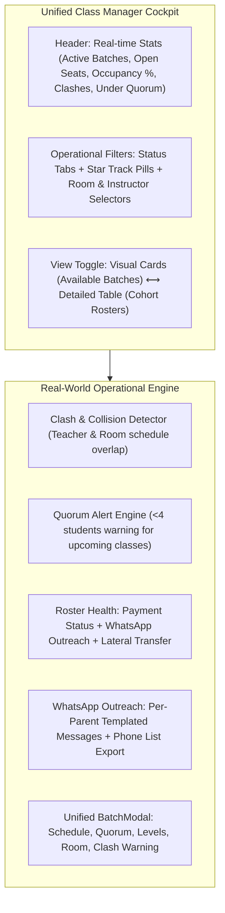

# Admin Dashboard: Classes & Real-World Operations Implementation Plan (Rev. 2)

Comprehensive audit, gap analysis, and architectural plan for transforming the **Admin & Front Office Classes Tab** into a unified, conflict-free operational cockpit for My Liberty English School.

> **Rev. 2 notes:** This revision was checked directly against the current codebase (`ClassManager.jsx`, `BatchModal.jsx`, `AvailableBatches.jsx`, `StudentRoster.jsx`, `PaymentModal.jsx`, `paymentPlans.js`). The original audit in Section 1 held up — all identified gaps are real. This revision resolves five open issues found during that check: the status-value migration, the WhatsApp broadcast's real technical limits, reuse of existing payment/WhatsApp utilities, the fixed (not free-text) nature of `classDay`, and a missing prop needed for live collision checking. Each is called out inline below with a **`[Rev.2]`** tag.

> **`[Rev.2]` Zero-budget constraint — confirmed hard requirement.** My Liberty English School has no budget for this project. Every item in this plan is achievable with **code changes only**, on infrastructure already in use:
> - No new paid API, library, or subscription is introduced anywhere in this plan.
> - Firebase (already used, free tier) and Cloudinary (`uploadFileToCloudinary`, already used for syllabus uploads) are the only external services touched, and neither gains new usage that would push past a free tier from this work.
> - The WhatsApp outreach in Pillar 4 uses only free `wa.me` links (the same mechanism already used elsewhere in the app) — the paid WhatsApp Business API is explicitly **out of scope** and is not required for anything in this plan to work.
> - Everything else (clash detection, quorum alerts, payment-health badges, status cleanup, form consolidation) is pure React/Firestore logic — no external service at all.
> If a future idea ever *would* require a paid tool, it should be flagged as an explicit trade-off before being added here, not assumed.

---

## 1. Executive Summary & "What's Currently Slipping"

Reviewing `ClassManager.jsx`, `AvailableBatches.jsx`, `BatchModal.jsx`, and real-world language school operations revealed several critical operational gaps:

### Critical Gaps Identified
1. **Fragmented & Conflicting Sub-Tabs**:
   - `ClassManager.jsx` is split into three discordant sub-tabs (confirmed: `classSubTab` state defaults to `"batches"`, with `"list"` and `"schedule"` as the others):
     - **"Available Batches"**: Rich cards with capacity meters, occupancy rate, marketing blurb generator, and modern `BatchModal`.
     - **"Class Rosters"**: Raw accordion grouping classes by `className::schedule::instructorId::classLevel`, with minimal controls and no capacity visibility.
     - **"Schedule New Class"**: An **outdated duplicate inline form** that lacks `minLevel`, `maxLevel`, `maxCapacity`, `status`, and file attachments that `BatchModal` already supports (confirmed: `BatchModal.jsx` already has all of these; the inline form in `ClassManager.jsx` has none of them).
   - This duplication confuses admins and leads to inconsistent batch records in Firestore (e.g. batches created without `maxCapacity`).
2. **Zero Teacher & Room Clash Detection**:
   - An admin can assign an instructor or a classroom (e.g. *"Studio Lab 2"*) to two different classes on the exact same days and overlapping time windows without any warning or validation (confirmed: no conflict-checking code exists anywhere in `src/features/classes/`).
   - In physical course operations, double-booking classrooms or teachers causes immediate on-site chaos.
3. **Missing Quorum & Financial Health Visibility in Rosters**:
   - Course centers rely on **Minimum Quorum** (e.g. minimum 4 or 5 students) for a batch to be financially viable. Right now, there is no under-quorum alert for upcoming classes.
   - When inspecting a class roster, admins see student names but **cannot see their payment status** (`paid`, `due_soon`, `expired`, or `pending`). An admin or instructor cannot tell if an attending student has an overdue tuition balance.
   - **`[Rev.2]`** This is cheaper to fix than it looks: a shared `getPaymentHealthStatus(paidUntil)` utility already exists in `src/constants/paymentPlans.js` and is already used in `StudentRoster.jsx` and `PaymentModal.jsx`. The class roster gap is a *display* gap, not a *logic* gap — no new health-calculation logic needs to be written, just imported and rendered as a badge.
4. **No Classroom Broadcast or Parent Outreach**:
   - If a class is rescheduled, moved to another room, or has homework updates, there is no fast way to reach all parents/students in that batch at once.
   - No direct WhatsApp button next to students in the class roster.
   - **`[Rev.2]`** Two corrections here:
     - A per-student "chat with parent on WhatsApp" button **already exists** in `StudentRoster.jsx` (`openWhatsAppParentChat`, built on a shared `normalizeWhatsAppNumber` helper and a `wa.me` link). The class-roster version of this button should reuse that helper, not reimplement it.
     - True one-click bulk messaging to an entire cohort **is not achievable for free.** WhatsApp has no public API for sending to multiple numbers at once without the paid WhatsApp Business API. What's realistic on a zero-budget stack is either (a) a copyable list of parent phone numbers, or (b) a row of individual pre-filled `wa.me` links the admin clicks through one at a time. See Pillar 4, revised.
5. **Class Lifecycle & Archival Gaps**:
   - Batches have real-world lifecycle phases:
     - `upcoming` (Registration open, start date in the future)
     - `open` / `in_progress` (Currently ongoing and actively meeting)
     - `completed` (Term finished, students graduated or eligible for level progression)
     - `cancelled` (Quorum not met, batch dissolved)
   - Completed and cancelled classes clutter active timetable views unless properly filtered and archived.
   - **`[Rev.2]`** `BatchModal.jsx` currently ships with **six** status values, not four: `open`, `upcoming`, `in_progress`, `full`, `completed`, `cancelled`. The lifecycle model below needs to explicitly say what happens to `open` and `full` — see Pillar 5, revised.

---

## 2. Proposed Architecture & Feature Pillars

---

### Pillar 1: Unified Cockpit & Elimination of Redundant Forms
- **Single Source of Truth Modal**: Deprecate the outdated inline `Schedule New Class` form in `ClassManager.jsx`. The "+ New Class Batch" button will consistently open the modern `BatchModal` (enhanced with collision checks and quorum settings).
- **Dual View Modes (Cards vs Table)**:
  - **Visual Batch Cards** (Available Batches grid): Ideal for quick capacity visualization, marketing blurb generation, and open seat checks.
  - **Cohort Operations Table** (Detailed Roster view): Ideal for auditing enrollments, reviewing student payment health, room management, and batch-level actions.
- **Unified Header KPI Summary**:
  - `Active Cohorts`, `Total Enrolled`, `Overall Occupancy %`, `Open Seats`, `Under Quorum (<4)`, and `Schedule Clashes (if any)`.

---

### Pillar 2: Teacher & Room Schedule Collision Detection
- **Collision Engine Algorithm**:
  - Compares days (`classDay`) and time intervals (`startTime` to `endTime`).
  - **`[Rev.2]`** `classDay` is a **fixed set of six values**, not free-form text: `"Mon/Wed"`, `"Tue/Thu"`, `"Fri Only"`, `"Sat Only"`, `"Sat/Sun"`, `"Everyday"`. This actually simplifies the engine — use a lookup table mapping each value to its set of weekdays, rather than generic slash-parsing. Two things the lookup must get right:
    - `"Everyday"` (Mon–Fri) overlaps with *every* other option except a pure `"Sat Only"`/`"Sat/Sun"` weekend batch.
    - `"Fri Only"` and `"Sat Only"` don't split cleanly on `"/"` like the other four values do — they need their own map entries, not a generic string split.
  - **`[Rev.2]`** `classRoom` is a **free-text field**, not a dropdown. Two classes both meaning "Studio Lab 2" could be stored as `"Studio Lab 2"`, `"studio lab 2"`, or with stray whitespace, and a naive string-equality check would miss the conflict. Normalize both sides (`.trim().toLowerCase()`) before comparing room names. If room data quality turns out to be too messy in practice, converting `classRoom` to a fixed dropdown of known rooms is the more robust fix — worth revisiting after initial rollout.
  - Flags:
    - **Teacher Conflict**: Instructor assigned to \(\ge 2\) active classes with overlapping day & time.
    - **Room Conflict**: Same classroom (normalized) booked by \(\ge 2\) active classes with overlapping day & time.
- **In-Form Warning**: When creating or editing a batch in `BatchModal`, if the selected instructor or room conflicts with an existing active batch, an immediate alert banner displays the conflicting batch name and schedule.
- **Cockpit Badge**: If any collision exists school-wide, a visible warning pill `⚠️ 1 Schedule Conflict` highlights in the filter bar.
- **`[Rev.2]` Required wiring not in the original plan**: `BatchModal.jsx` currently only receives `batch, instructors, onClose, onSuccess` as props — it has no visibility into the other classes, so it cannot check for collisions on its own. A new prop (e.g. `existingClasses`) must be threaded through, and `<BatchModal>` is instantiated in **three places** that all need updating: two in `AvailableBatches.jsx` and one in `ClassManager.jsx`.

---

### Pillar 3: Quorum & Financial Health Visibility
- **Minimum Quorum Tracking**:
  - Add optional `minQuorum` field in `classes` (defaults to 4).
  - Classes marked `upcoming` or `open` with fewer than `minQuorum` enrolled students display an amber `⚠️ Under Quorum (X/4)` badge, prompting marketing or FO to fill seats before class start.
- **Payment Health in Class Rosters**:
  - In each batch's student list, display the student's current tuition health badge:
    - `Active` (green)
    - `Due Soon` (amber)
    - `Expired` (red)
    - `Pending` (amber)
    - `No Plan` (gray)
  - **`[Rev.2]`** Reuse, don't rebuild: `getPaymentHealthStatus(paidUntil)` in `src/constants/paymentPlans.js` already computes this exact status and is already imported by `StudentRoster.jsx` and `PaymentModal.jsx`. Import the same function into the roster view rather than writing new health-calculation logic. This makes Pillar 3 one of the lowest-risk, fastest-to-ship pieces of the whole plan.
  - Empowers admins and front desk to immediately spot tuition lapses during class inspections.

---

### Pillar 4: Classroom Outreach & Parent Messaging *(Revised)*
- **`[Rev.2]`** Reframed from "1-Click Broadcast" to "fast per-parent outreach," to match what's actually possible without a paid messaging API:
- **Per-Student WhatsApp Button in Roster**:
  - Reuse the existing `openWhatsAppParentChat` + `normalizeWhatsAppNumber` pattern from `StudentRoster.jsx`, wired to a batch-relevant pre-filled message (e.g. room/schedule reminder) instead of the payment-reminder text it currently sends.
- **Batch Outreach Panel** (replaces "Batch WhatsApp Broadcast" modal):
  - A panel listing every student/parent in the cohort with:
    1. A pre-filled message template selector (Class Reminder & Room Assignment / Reschedule / Homework Announcement).
    2. A `wa.me` link per parent using that template — admin clicks through the list one at a time (this is the real ceiling of what a free `wa.me`-based approach can do).
    3. A "Copy all parent numbers" button, for admins who'd rather paste the list into an actual WhatsApp broadcast list or group they manage manually.
  - This is honestly still a big time-saver over the status quo (no tooling at all) — it just isn't a true one-click mass send, and the plan/UI copy should say so rather than imply otherwise.

---

### Pillar 5: Complete Lifecycle Management (`status`) *(Revised)*
- **`[Rev.2]`** `BatchModal.jsx` currently has six status values in production: `open`, `upcoming`, `in_progress`, `full`, `completed`, `cancelled`. The canonical model below must account for all six, not assume only four:
  - `upcoming`: Planning / Registration open, starting in future. *(unchanged)*
  - `in_progress`: Currently conducting classes. **`open` is treated as a legacy synonym for `in_progress`/active** — existing records keep working, but the `BatchModal` dropdown and any new batches use `in_progress` going forward. (Decision needed from Liberty: is `open` actually meant to signal "still accepting enrollment," distinct from `in_progress`? If so, keep both as-is and treat `open` as a *sub-state* of active rather than merging it — flag this for the user review below.)
  - `full`: **Becomes a computed/derived badge** (enrolled ≥ maxCapacity) rather than a status an admin manually sets, to avoid it going stale. Existing records with `status: "full"` are read as `in_progress` for filtering purposes, with the "Full" badge computed live from enrollment count instead.
  - `completed`: Finished term, archived. *(unchanged)*
  - `cancelled`: Dissolved. *(unchanged)*
- **Migration note**: Before shipping the new filter tabs, run a one-time pass (or a defensive read-time fallback) over existing Firestore `classes` documents so old `status: "open"` / `status: "full"` values don't silently disappear from the new `Active & Upcoming` filter.
- Filter tabs:
  - `Active & Upcoming` (Default operational view)
  - `Under Quorum (<4)`
  - `Filling Fast & Full`
  - `Completed / Archived`
  - `All Cohorts`

---

## 3. User Review Required

> [!IMPORTANT]
> **Consolidation Decision**: We propose replacing the redundant inline sub-tab "Schedule New Class" with a direct trigger of the enhanced `BatchModal`. This eliminates code duplication and ensures every batch created has `maxCapacity`, `minQuorum`, `classLevel`, `room`, and clash validation.
>
> **Default Minimum Quorum**: Proposed default is **4 students**. Does this match Liberty English School's standard cohort size?
>
> **Schedule Conflict Rules**: Conflicts will only be calculated between classes with status `upcoming` or `in_progress` (completed or cancelled classes are ignored).
>
> **`[Rev.2]` Status model**: Does `open` mean something operationally different from `in_progress` at Liberty (e.g. "still taking new enrollments" vs. "enrollment closed, running")? If yes, we keep it as a distinct status rather than merging it — please confirm before Component D is built, since it changes the filter-tab logic.
>
> **`[Rev.2]` WhatsApp expectations — confirmed**: No budget for the paid WhatsApp Business API. Pillar 4 ships as the free per-parent `wa.me`-link + copy-list panel described above, not a true one-click mass broadcast.

---

## 4. Proposed Changes by Component

### Component A: Schedule Conflict Engine
#### [NEW] [`src/features/classes/scheduleConflict.js`](file:///E:/myliberty-portal/src/features/classes/scheduleConflict.js)
- `parseTimeMinutes(timeStr)`: Converts `"17:00"` to `1020` minutes.
- `doDaysOverlap(dayA, dayB)`: **`[Rev.2]`** Looks up each of the six fixed `classDay` values against a weekday-set map (rather than generic string splitting) and checks for intersection, with `"Everyday"` matching all weekday-containing options.
- `doTimesOverlap(startA, endA, startB, endB)`: Checks if intervals intersect.
- `findScheduleConflicts(classes)`: Detects room collisions (room names normalized via `.trim().toLowerCase()`) and instructor collisions across all active classes. Returns `{ teacherConflicts, roomConflicts }`.

---

### Component B: Batch Modal Enhancement
#### [MODIFY] [`src/features/classes/BatchModal.jsx`](file:///E:/myliberty-portal/src/features/classes/BatchModal.jsx)
- Add `minQuorum` input field (default 4).
- **`[Rev.2]`** Accept a new `existingClasses` prop (list of other active batches) so the modal can run `findScheduleConflicts` live as the user selects instructor, room, days, and times.
- Show real-time collision alert banner if a conflict is detected before submission.
- Update the `status` dropdown per the revised Pillar 5 model (keep all six options unless the `open` question above resolves to merging it).

---

### Component C: Batch Outreach Panel
#### [NEW] [`src/features/classes/BatchOutreachPanel.jsx`](file:///E:/myliberty-portal/src/features/classes/BatchOutreachPanel.jsx)
*(renamed from `BatchBroadcastModal.jsx` to match the revised Pillar 4 scope)*
- Panel displaying cohort students, parent contact numbers, and template selector (Class Reminder, Schedule Change, General Announcement).
- Per-parent `wa.me` links (reusing `normalizeWhatsAppNumber` from the students feature) plus a "copy all numbers" action.

---

### Component D: Unified Class Manager
#### [MODIFY] [`src/features/classes/ClassManager.jsx`](file:///E:/myliberty-portal/src/features/classes/ClassManager.jsx)
- Replace fragmented 3-subtab layout with a clean **View Switcher** (Visual Cards vs Cohort Table).
- Remove outdated inline schedule form; replace with "+ Schedule New Class" button launching `BatchModal` (passing `existingClasses`, per Component B).
- Add Quick Status Filter Bar (Active, Under Quorum, Filling Fast, Archived) using the revised status model from Pillar 5.
- In Cohort Table view:
  - Display Room, Level badge, Instructor, Capacity bar, Quorum status, and Lifecycle status.
  - In student list: Display student payment health status badge (via `getPaymentHealthStatus`) and WhatsApp parent outreach button (via `openWhatsAppParentChat` pattern).
  - Add "Outreach" button to batch row/card, opening the Component C panel.

---

### Component E: Re-exports & Shared Integration
#### [MODIFY] [`src/features/classes/index.js`](file:///E:/myliberty-portal/src/features/classes/index.js)
- Re-export `BatchOutreachPanel`, `findScheduleConflicts`, `parseTimeMinutes`, `doDaysOverlap`.

#### [MODIFY] [`src/features/classes/AvailableBatches.jsx`](file:///E:/myliberty-portal/src/features/classes/AvailableBatches.jsx)
- **`[Rev.2]`** Both existing `<BatchModal>` call sites here need the new `existingClasses` prop threaded through, same as Component D.

---

## 5. Verification Plan

### Automated Verification
- Run `npm run lint` (ensure 0 errors, 0 warnings).
- Run `npm run build` (ensure clean production Vite bundle).

### Functional / Edge Case Verification
1. **Clash Detection**:
   - Create Class A in "Studio Lab 1" on "Mon/Wed" at 17:00-18:30 with Instructor X.
   - Attempt to create Class B with Instructor X on "Mon/Wed" at 17:30-19:00 → verify conflict banner appears immediately.
   - Attempt to create Class C in "studio lab 1" (different casing/spacing) on "Mon/Wed" at 17:30-19:00 → verify room conflict banner still appears (normalization check).
   - Create a class with `classDay: "Everyday"` and verify it correctly flags a conflict against a `"Fri Only"` class in the same room/time.
2. **Quorum Alert**:
   - Class with 2 students → shows amber `⚠️ Under Quorum (2/4)`.
   - Class with 5 students → shows normal status.
3. **Payment Transparency in Roster**:
   - In class student list, verify students show `Active`, `Due Soon`, or `Expired` badges correctly matching their `paidUntil` date, using the shared `getPaymentHealthStatus` output (should match what's shown for the same student in `StudentRoster.jsx`).
4. **Status migration**:
   - Verify an existing Firestore batch with `status: "open"` still appears under the `Active & Upcoming` filter tab after the change ships.
   - Verify an existing batch with `status: "full"` still appears, and that its "Full" badge is computed from live enrollment count rather than the stored status.
5. **WhatsApp Outreach**:
   - Open the Outreach panel on a batch → verify each parent has a working pre-filled `wa.me` link (Indonesian message including batch name, room, and teacher name) and the "copy all numbers" action produces a correctly formatted list.
