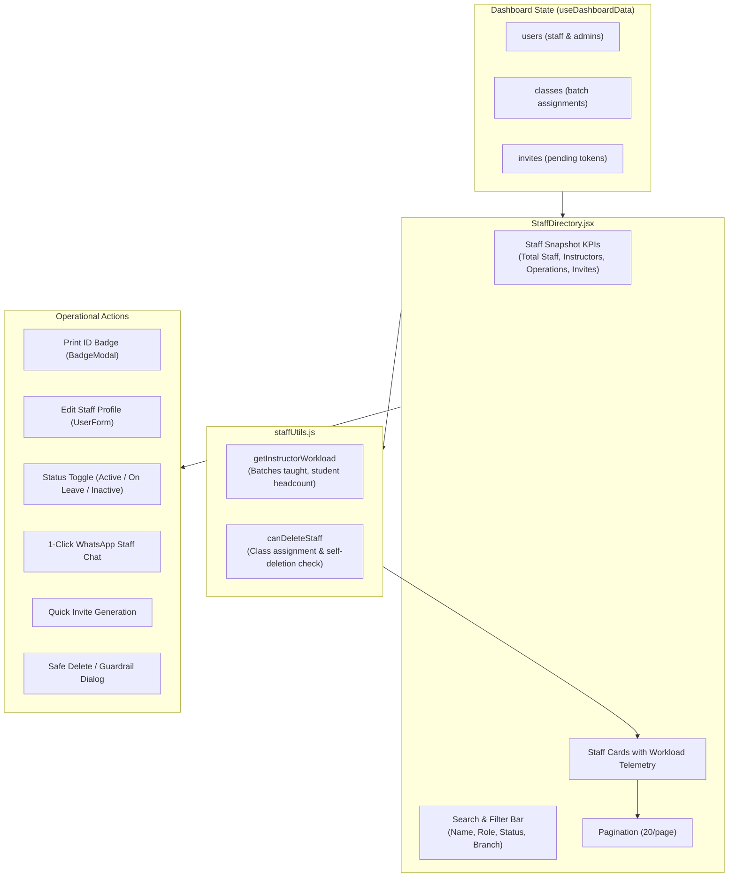

# Staff Directory & Real-World Operations Implementation Plan

Turns the basic, inline "Staff" tab in `AdminDashboard` into a modular, production-ready **Staff Operations Cockpit**, providing real-world staff lifecycle management, workload telemetry (classes & students taught), safe deactivation guardrails, and unified onboarding while strictly preserving system-wide consistency across `users`, `classes`, `attendance`, and Firebase Auth.

---

## User Review Required

> [!IMPORTANT]
> **Key Operational Decisions to Align Before Execution:**
>
> 1. **Staff Deactivation vs. Permanent Deletion**
>    - **Current behavior**: Clicking "Delete" executes `deleteDoc(doc(db, "users", uid))`. This instantly severs the instructor from assigned classes (leaving dead `instructorId` pointers in `classes`), orphans historical shifts in `shifts` (breaking attendance reports and payroll audits), and leaves orphaned credentials in Firebase Auth.
>    - **Proposed change**: 
>      - Introduce staff lifecycle status: `status: "active" | "on_leave" | "resigned" | "terminated"`. Existing staff without a status default to `"active"`.
>      - Provide a 1-click **Deactivate / Status Change** action (`updateStaffRecord(uid, { status })`) as the standard operational exit.
>      - **Safety Guardrail on Deletion**: If staff has assigned classes in `classes`, hard deletion is blocked: `"Cannot delete: This instructor is assigned to active classes ([Class Names]). Reassign their classes first, or mark as Inactive."`
>      - Permanent delete remains available only for unassigned / test staff behind a strict confirmation.
>
> 2. **Staff Workload & Telemetry Visibility**
>    - For instructors, dynamically derive active teaching commitments from `classes`:
>      - Number of assigned batches.
>      - Names and schedule of current classes (e.g. *English for Teens A · Mon/Wed*).
>      - Total active students taught.
>    - **User constraint applied**: Workload telemetry is displayed **strictly on the Instructor sub-tab / filter**. When browsing the "All" view or other roles, cards remain lean and uncluttered.
>
> 3. **Visibility of Admin Profiles**
>    - **Current behavior**: `AdminDashboard.jsx` explicitly filters out admins: `users.filter(u => u.role !== "student" && u.role !== "admin")`.
>    - **Proposed change**: Allow Admin accounts to be displayed in the Staff Directory with a dedicated `Admin` role badge/filter. Prevent self-deletion of the currently logged-in admin (`u.id === currentUserId`).
>    - **User constraint applied**: Admins do not receive a "Print Badge" button ("who's gonna scan them anyway"). Badges remain exclusively for operational staff who scan into shifts.
>
> 4. **Unified Onboarding Access**
>    - Provide direct "Add Staff" and "Generate Invite" actions inside the Staff Directory header, bridging the gap between direct creation (`UserForm`) and public invite links (`InvitesPanel`).

---

## 1. System Consistency Matrix

| Target Domain | Current State / Risk | Staff Cockpit Guarantee |
| :--- | :--- | :--- |
| **`users` Collection** | Staff records only hold basic contact fields; no `status`, `branch`, or `photoURL`. | Added `status` (`active / on_leave / resigned / terminated`), `branch`, and optional `photoURL`. Missing `status` defaults to `"active"` via `(u.status \|\| "active")`. |
| **`classes` Collection** | Deleting an instructor leaves dead `instructorId` pointers in classes, breaking roster displays. | Safe deletion check: prevents hard delete if `classes.some(c => c.instructorId === u.id)`. Recommends deactivation instead. |
| **`shifts` & Attendance** | Historical shift records reference `userId`. Deleting staff causes null user lookups in reports. | Deactivated staff remain in `users` with `status: "resigned"`, preserving complete historical payroll and attendance logs. |
| **Firebase Auth vs Firestore** | `deleteDoc` only removes the Firestore doc; Auth credentials remain active on Firebase. | Deactivating marks the profile inactive, signaling to system RBAC that the user is no longer active staff. |
| **WhatsApp Outreach** | No quick messaging on staff cards. | Standardized 1-click WhatsApp outreach using shared `normalizeWhatsAppNumber`. |
| **UI Modularization** | 40-line inline JSX snippet in `AdminDashboard.jsx` with `max-h-[450px]` overflow. | Extracted into a standalone `StaffDirectory.jsx` component with search, role filters, status filters, and `usePagination` (20/page). |

---

## 2. Feature Architecture Overview



---

## 3. Proposed File Changes

### 3.1 Plain JS Helpers: `src/features/staff/staffUtils.js` (NEW)
Project rule: plain helpers in `.js` files to keep components clean (`react-refresh/only-export-components`).
- **`STAFF_ROLES`**: array of tracked staff roles (`["instructor", "frontoffice", "manager", "marketing", "officeboy", "admin"]`).
- **`STAFF_ROLE_LABELS`**: human-friendly labels (e.g. `officeboy` -> `Office Boy`, `frontoffice` -> `Front Office`).
- **`STAFF_STATUS_OPTIONS`**: `["active", "on_leave", "resigned", "terminated"]`.
- **`getInstructorWorkload(instructorId, classes)`**:
  - Finds all classes where `c.instructorId === instructorId`.
  - Calculates `batchCount = assignedClasses.length`.
  - Calculates `studentCount = sum of (c.studentIds.length)`.
  - Returns `{ assignedClasses, batchCount, studentCount }`.
- **`canDeleteStaff(staffUser, classes, currentUserId)`**:
  - Returns `{ canDelete: boolean, reason: string }`.
  - Blocked if `staffUser.id === currentUserId` ("Cannot delete your own account while logged in").
  - Blocked if `assignedClasses.length > 0` ("Instructor is currently assigned to N active classes").
- **`filterStaffMembers({ users, search, roleFilter, statusFilter, branchFilter })`**:
  - Filters `users` for `role !== "student"`.
  - Applies search, role, status (`(u.status || "active")`), and branch filters.
  - Sorts alphabetically by `displayName`.

---

### 3.2 Modular Component: `src/features/staff/StaffDirectory.jsx` (NEW)
Extracts staff management from `AdminDashboard.jsx` into a dedicated cockpit:
- **Props**:
  - `users = []`, `classes = []`, `invites = []`
  - `currentUserId = null`
  - `onAddStaff` (triggers `handleAddStaff` -> `UserForm`)
  - `onEditStaff` (triggers `handleEdit` -> `UserForm`)
  - `onPrintBadge` (triggers `setSelectedStudent` -> `BadgeModal`)
  - `onDeleteStaff` (triggers `handleDelete`)
  - `onNavigateToInvites` (triggers tab switch to `invites`)
- **Header KPIs**:
  - Total Staff count
  - Instructors count
  - Operations / Front Desk count
  - Pending Invitations count (with badge and 1-click invite launcher)
- **Search & Filters**:
  - Search input: Name, nickname, email, phone.
  - Role pill buttons: `All`, `Instructor`, `Front Office`, `Manager`, `Marketing`, `Office Boy`, `Admin`.
  - Status filter dropdown: `All Statuses`, `Active`, `On Leave`, `Inactive / Resigned`.
- **Staff Cards**:
  - Photo / Initials avatar with role-colored badge.
  - Display name, nickname, email, phone.
  - Role pill + Status pill (`🟢 Active`, `🟡 On Leave`, `⚪ Inactive`).
  - **Instructor Workload Telemetry**: For instructors, shows assigned class badges (e.g. `2 Batches · 18 Students`) with class names.
  - **Action buttons**:
    - **Badge**: Print credential QR badge.
    - **Edit**: Edit profile in `UserForm`.
    - **WA**: 1-click WhatsApp outreach.
    - **Status Change**: Quick toggle/dropdown to update employment status.
    - **Delete**: With guardrail checking `canDeleteStaff`.
- **Pagination**:
  - Uses `usePagination` from `features/shared` (20 staff per page).

---

### 3.3 Public Exports: `src/features/staff/index.js` (MODIFY)
- Export `StaffDirectory` from `./StaffDirectory`.
- Export helpers from `./staffUtils`.

---

### 3.4 Data Schema & Repository: `src/features/dashboard/usersRepository.js` & `useDashboardData.js` (MODIFY)
- In `useDashboardData.js`:
  - When saving staff in `handleSave`:
    Include `status: formData.status || "active"`, `branch: formData.branch || ""`, `photoURL: formData.photoURL || ""`.
  - In `handleEdit`:
    Populate `status: user.status || "active"`, `branch: user.branch || ""`, `photoURL: user.photoURL || ""`.
  - In `emptyFormData`:
    Include `status: "active"`, `branch: ""`.
- In `usersRepository.js`:
  - Add `updateStaffStatus(uid, status)` helper for quick status updates directly from the directory without opening the full user form.

---

### 3.5 Staff Form Enhancements: `src/features/students/UserForm.jsx` (MODIFY)
- In the staff profile section (lines 485–593):
  - Add **Photo Capture / Upload** (`StudentPhotoCapture`) for staff headshot ID badges.
  - Add **Branch** input (e.g. `Cabang Utama`).
  - Add **Employment Status** select (`Active`, `On Leave`, `Inactive / Resigned`).

---

### 3.6 Dashboard Integration: `src/features/dashboard/AdminDashboard.jsx` (MODIFY)
- Remove inline `directoryTab` (lines 138–179).
- Replace `{ id: "directory", label: "Staff", component: directoryTab }` with:
  ```jsx
  {
    id: "directory",
    label: "Staff",
    component: (
      <StaffDirectory
        users={users}
        classes={classes}
        invites={invites}
        currentUserId={auth.currentUser?.uid}
        onAddStaff={handleAddStaff}
        onEditStaff={handleEdit}
        onPrintBadge={setSelectedStudent}
        onDeleteStaff={handleDelete}
        onNavigateToInvites={() => handleTabChange("invites")}
      />
    ),
  }
  ```

---

## 4. Out of Scope (What NOT to do)

- No changes to Firebase Auth server-side APIs (Spark plan constraint; account deletion in Auth remains a manual console task if an email needs to be reused).
- No changes to `firestore.rules` (rules already allow Admin full create/read/update/delete on `users`).
- No redesign of the separate `invites` tab (`InvitesPanel` continues to work exactly as designed).

---

## 5. Verification Plan

### Automated Verification
- `npm run lint` — verify zero ESLint errors across all modified files.
- `npm run build` — verify Vite production build succeeds cleanly.

### Manual / Operational Scenarios
1. **Directory View & Search**: Verify staff members load with correct roles, and search filters by name, phone, or email.
2. **Workload Telemetry**: Verify instructors display the exact count and names of classes they teach.
3. **Safe Deletion Guardrail**:
   - Try to delete an instructor assigned to active classes &rarr; verify alert prevents deletion and suggests deactivation.
   - Try to delete the currently signed-in admin &rarr; verify self-deletion is prevented.
4. **Status Lifecycle**:
   - Toggle a staff member to `On Leave` or `Inactive` &rarr; verify status badge updates immediately.
5. **Print Badge & WhatsApp**:
   - Click "Print Badge" &rarr; verify `BadgeModal` opens with valid QR code.
   - Click "WA" &rarr; verify WhatsApp opens with properly normalized Indonesian number.
