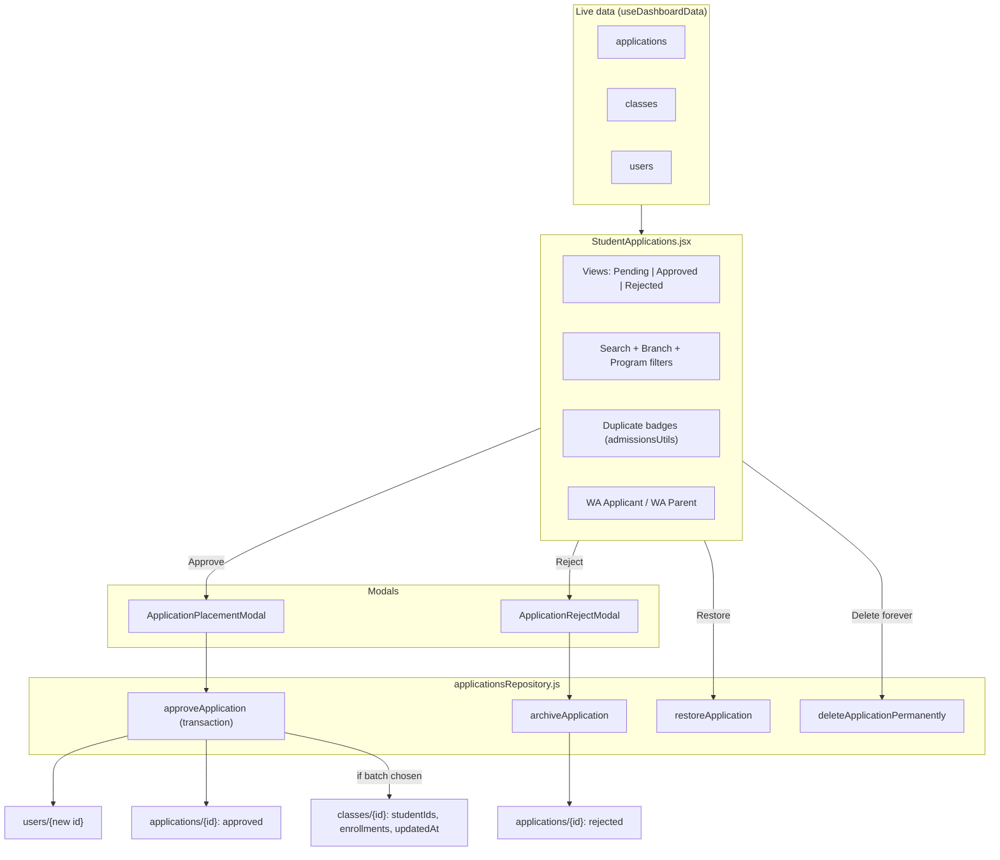

# Student Applications & Admissions Implementation Plan (v2)

Turns the "Applications" tab into an Admissions Cockpit for **Admin and Front Office**, while keeping `users`, `classes`, `applications`, and every dashboard counter consistent.

**v2 status:** audited against the real codebase. All decisions below are **locked**. The executing agent should not re-open them; if something in the code contradicts this plan, stop and report it instead of improvising.

---

## 0. Locked Decisions

| # | Decision | Detail |
| :-- | :--- | :--- |
| D1 | **Reject = soft-archive** | Reject sets `status: "rejected"` plus audit fields. Nothing is deleted. Staff can **Restore to Pending** or **Delete permanently** from the Rejected view. |
| D2 | **Approve keeps the application** | Approve sets `status: "approved"` plus `approvedAt`, `approvedBy`, `studentId`. The application is **not** deleted. |
| D3 | **Approve is one atomic transaction** | Student creation, application update, and optional class placement all succeed or all fail together (see 3.1). |
| D4 | **Placement happens at approval** | An Intake Placement Modal lets staff confirm level, optionally pick a batch, and confirm payment plan. |
| D5 | **Duplicate guardrail** | Applicants are compared against existing students and other pending applications. Strong matches require an explicit "this is a new student" tick before approving. |
| D6 | **Level model is unchanged** | Only `currentLevel` (`warrior / elite / master / grandmaster / epic`) is stored. The 3-star tier (Beginner ⭐ / Intermediate ⭐⭐ / Fluent ⭐⭐⭐) is always derived from `constants/levels.js`. Never add a stored "tier" field. |
| D7 | **No Firestore rules change** | Existing rules already allow every write in this plan. Only a comment in `firestore.rules` is updated (no deploy needed). |

---

## 1. Consistency Matrix

| Domain | Current problem | v2 guarantee |
| :--- | :--- | :--- |
| **`users`** | `approveApplication` passes raw form fields, so `currentLevel`, `paymentPlan`, `status` fall back to hidden defaults. | `buildStudentRecord` receives explicit `currentLevel`, `paymentPlan`, `status: "active"`, `joinedDate: today`. |
| **`classes`** | Approved students float with no class. | Optional batch placement happens **inside the same transaction**, writing `studentIds`, `enrollments`, `updatedAt` exactly like `addStudentToClass`. |
| **`applications`** | Approve and reject hard-delete the record. | Statuses: `pending` / `approved` / `rejected`. Missing `status` is treated as `pending` everywhere via `(status \|\| "pending") === "pending"`. |
| **Counters** | `StaffDashboard` and `MarketingDashboard` use raw `snap.size`. | All five dashboards count pending only. |
| **WhatsApp** | Local `normalizeWhatsAppPhone` in `StudentApplications.jsx`. | Unified on the shared `normalizeWhatsAppNumber`, fixed to also handle numbers typed without the leading 0. |
| **Data source** | `StudentApplications` re-runs `getDocs` after every action. | It receives live `applications`, `classes`, `users` from `useDashboardData`. |

> **Never** query applications with `where("status","==","pending")`. Older documents may have no `status` field and would be silently skipped. Always filter in JavaScript with `(status || "pending")`.

---

## 2. Architecture

---

## 3. File Changes

### 3.1 `src/features/students/applicationsRepository.js` (MODIFY)

Remove `fetchApplications()` and `rejectApplication()`. Keep the file as write-only functions. Imports needed: `runTransaction`, `doc`, `collection`, `updateDoc`, `deleteDoc`, `deleteField`, `arrayUnion` from `firebase/firestore`.

**`approveApplication({ app, level, paymentPlan, classId = null, actorEmail })`** returns the new student object `{ id, ...record }`. Implement with a single `runTransaction`, reads first, then writes:

1. **Read** `applications/{app.id}`. If it does not exist, or `(status || "pending") !== "pending"`, throw `Error("This application was already processed by someone else.")`.
2. **If `classId`:** read `classes/{classId}`. Compute availability with `getBatchAvailability` (3.4). If the class is missing or `!canEnroll`, throw `Error("This batch is full or no longer open.")`.
3. **Final level** = the class's `classLevel` if a class was chosen (fallback to `level`), otherwise `level`.
4. **Write** (all in the same transaction):
   - `users/{new auto id}` = `buildStudentRecord({ ...same fields as today, currentLevel: finalLevel, paymentPlan, status: "active", joinedDate: today (YYYY-MM-DD), photoURL: app.photoURL || "" })`. Keep the current field list (displayName, phone, dob, gender, placeOfBirth, religion, address, branch, program, classType, schoolOrJob, classOrSemester, referralSource, father/mother name/job/phone).
   - `applications/{app.id}` updated with `{ status: "approved", approvedAt: ISO string, approvedBy: actorEmail, studentId: <new id> }`.
   - If `classId`: `classes/{classId}` updated with `studentIds: arrayUnion(newId)`, `enrollments: arrayUnion({ studentId: newId, dateJoined, level: finalLevel })`, `updatedAt: ISO string`. `dateJoined` = the class's `classStartDate` or today (same default `EnrollModal` uses).
5. Do **not** call `syncStudentsCurrentLevel` afterwards; the level is already correct on the new record.

**`archiveApplication(appId, { reason, note, actorEmail })`**: transaction that reads the application and throws if it is not pending, then sets `status: "rejected"`, `rejectedAt` (ISO), `rejectedBy`, `rejectedReason: reason || ""`, `rejectedNote: note || ""`.

**`restoreApplication(appId)`**: only for `rejected` records. Sets `status: "pending"` and removes the four reject fields with `deleteField()`.

**`deleteApplicationPermanently(appId)`**: `deleteDoc`. The UI only offers this on the Rejected view, behind a confirm.

Update the file's header comment: it currently says applications are deleted on approve/reject. That is no longer true.

---

### 3.2 `src/features/students/admissionsUtils.js` (NEW, plain `.js`, no JSX)

Project rule: helpers live in `.js` files so the component files only export components (`react-refresh/only-export-components`).

- **`isPending(app)`**: `(app.status || "pending") === "pending"`.
- **`getPhoneKey(phone)`**: `normalizeWhatsAppNumber(phone)` from `../finance/receiptMessages`; returns `""` if fewer than 9 digits (so blanks and junk never match).
- **`getNameKey(name)`**: lowercase, keep letters only (Unicode aware), split on whitespace, sort words alphabetically, join with a space. Word order is ignored. No fuzzy/Levenshtein matching.
- **`getDobKey(dob)`**: extract all numeric groups from the string, sort them, join with `-`; `""` if fewer than 3 groups. This makes `15/03/2010`, `3/15/2010`, and `2010-03-15` compare equal. *Reason:* `dob` arrives from the Google Form as whatever text the form produced (see `FormSync.gs`), not guaranteed ISO. **The executing agent must look at one or two real application documents and confirm this handles them.**
- **`findDuplicates(app, students, applications)`** returns `{ students: [{ student, strength, reason }], pendingTwins: [{ app, strength }] }`:
  - `strong` = phone keys match (both non-empty) **or** (name keys match **and** DOB keys match, both non-empty).
  - `possible` = name keys match only.
  - `students` list: only `role === "student"`. `pendingTwins`: other applications where `isPending` is true and `id !== app.id`.
  - A parent's phone shared with another student is a sibling, **not** a duplicate. Do not flag it in v2.
- **`buildApplicantWhatsAppUrl({ target, app })`**: `target` is `"applicant"` or `"parent"`. Returns `null` if there is no usable number. Uses `normalizeWhatsAppNumber`. Parent number = `app.fatherPhone || app.motherPhone`. Messages are in Indonesian and mention the applied program (`app.program || "General Program"`):
  - Applicant: `Halo Kak {name}! Terima kasih telah mendaftar di My Liberty English Academy ({program}). Kami dari tim Admissions ingin mengonfirmasi jadwal placement test dan informasi kelas Anda. Apakah saat ini waktu yang tepat untuk berdiskusi?`
  - Parent: `Halo Bapak/Ibu, orang tua dari {name}! Terima kasih telah mendaftarkan {name} di My Liberty English Academy ({program}). Kami dari tim Admissions ingin mengonfirmasi jadwal placement test dan informasi kelas. Apakah saat ini waktu yang tepat untuk berdiskusi?`
- **`filterApplications({ apps, view, search, branch, program })`**: `view` is `"pending" | "approved" | "rejected"`. `search` matches name, phone, parent phones, school/job (case-insensitive). Sort: pending by `submittedAt` desc, approved by `approvedAt` desc, rejected by `rejectedAt` desc.
- **`getDistinctValues(apps, field)`**: sorted unique non-empty values, used to build the Branch and Program dropdowns. `program` is free text from the form, so **never hard-code these options**.

---

### 3.3 `src/features/finance/receiptMessages.js` (MODIFY)

Fix `normalizeWhatsAppNumber`: after the existing `0` and `62` cases, add: if the digits start with `8`, return `"62" + digits`. Today `812 3456 7890` (typed without the leading 0, common in Google Form answers) stays `812…`, which produces a dead WhatsApp link. The change is backward-compatible and also improves receipts and renewal reminders.

---

### 3.4 `src/features/classes/batchAvailability.js` (NEW, plain `.js`)

`getBatchAvailability(cls)` returns `{ studentCount, capacity, seatsAvailable, computedStatus, canEnroll }`, using the same maths that already exists inline in `AvailableBatches.jsx`:
- `studentCount = (cls.studentIds || []).length`
- `capacity = Number(cls.maxCapacity) || 15`
- `seatsAvailable = Math.max(0, capacity - studentCount)`
- `computedStatus` follows the existing rules (`cancelled`, `completed`, `in_progress`, `full`, `filling_fast`, else `cls.status || "open"`).
- `canEnroll = seatsAvailable > 0 && cls.status !== "cancelled" && cls.status !== "completed"`. *(`in_progress` batches stay enrollable, because late joiners are normal, and this matches what `EnrollModal` allows today.)*

Used by the placement modal and by `approveApplication`. **Do not refactor `AvailableBatches.jsx` or `TransferModal.jsx` in this task.**

---

### 3.5 `src/features/students/ApplicationPlacementModal.jsx` (NEW)

Props: `app`, `classes`, `duplicates` (result of `findDuplicates`), `submitting`, `onClose`, `onConfirm({ level, paymentPlan, classId, openProfile })`. The modal is presentational; the parent calls the repository.

Sections:
1. **Applicant summary:** photo/initials, name, DOB as stored (show age **only** if the value parses as `YYYY-MM-DD`), phone, parent phones, school/job, applied program, branch, **class type (read-only, e.g. Reguler / Private)**.
2. **Duplicate warning:** if `duplicates` has any match, show it here too. If any match is `strong`, the confirm button stays disabled until staff tick "I checked, this is a new student."
3. **Level:** one dropdown built from `LEVEL_LIST`, grouped by star tier (⭐ Beginner: Warrior, Elite · ⭐⭐ Intermediate: Master, Grandmaster · ⭐⭐⭐ Fluent: Epic). Default `warrior`. Do **not** try to guess the level from `program` (it is free text). Only the level is saved.
4. **Batch (optional):** dropdown of classes where `getBatchAvailability(cls).canEnroll`. Option text: `ClassName · Level · schedule · x / capacity seats`. Batches compatible with the chosen level (`isCompatible`) are listed first. Choosing a batch **locks the level to the batch's `classLevel`**. If it differs from what staff picked, show an amber note: "Level will be set to {Level} to match this batch." Default option: "No batch yet (enroll later)".
5. **Payment plan:** dropdown from `PAYMENT_PLAN_LIST` (`monthly`, `quarterly`, `semester`, `annual`, `biennial`), default `monthly`. *(Class type and payment plan are independent; "Private" is a class type, not a plan.)*
6. **Checkbox:** "Open full profile after approving" (off by default).
7. **Button:** "Confirm Admission & Enroll" (label becomes "Confirm Admission" when no batch is chosen), with a loading state.

Use the shared UI kit (`LevelBadge`, `Badge`, `useToast`) and match the visual style of `EnrollModal.jsx`.

---

### 3.6 `src/features/students/ApplicationRejectModal.jsx` (NEW)

Props: `app`, `submitting`, `onClose`, `onConfirm({ reason, note })`. (`useConfirm` is yes/no only, so this needs its own component.) A reason dropdown: Schedule conflict, Unreachable / No response, Outside age bracket, Duplicate entry, Other. Plus an optional note textarea. The reason is optional. Button: "Reject & Archive".

---

### 3.7 `src/features/students/StudentApplications.jsx` (MODIFY)

- **Props:** `applications = []`, `classes = []`, `users = []`, `onApproveAndEdit = null`, `onViewStudent = null`. Remove the internal `getDocs` fetching, `loading` state, and the local `normalizeWhatsAppPhone` / `getWhatsAppUrl`. Data updates live.
- **Actor:** `auth.currentUser?.email` (same pattern as `PaymentModal`'s `recordedBy`). No new props needed for identity.
- **Views:** tab switcher `Pending (N)` · `Approved` · `Rejected`. `N` uses `isPending`.
- **Filter bar:** search input, Branch dropdown, Program dropdown (options from `getDistinctValues`).
- **Pagination:** use the existing `usePagination` / `Pagination` from `features/shared`, following how `StudentRoster.jsx` uses them (20 per page).
- **Pending cards:**
  - Existing dossier layout stays.
  - Duplicate badges from `findDuplicates`: strong = amber `⚠️ Existing student: {Name} ({Batch name or "no batch"})`; possible = lighter `Possible match: {Name}`; twin application = `Duplicate submission: also applied on {date}`. Clicking a student badge calls `onViewStudent(student)` (dashboards pass `handleEdit`).
  - Buttons: **Approve** (opens the placement modal), **Reject** (opens the reject modal), **WA Applicant** and **WA Parent** (both shown whenever a usable number exists).
- **Approved cards:** read-only. Show approved date/by, a "Student created" note with `studentId`, and a link that calls `onViewStudent` when that student exists in `users`.
- **Rejected cards:** show rejected date, by, reason, note. Buttons: **Restore to Pending** and **Delete permanently** (confirm via `useConfirm`, with the message that this cannot be undone).
- **After approve:** success toast. If "Open full profile" was ticked and `onApproveAndEdit` exists, call it with the new student; otherwise stay on the tab.
- **Errors:** show `err.message` in an error toast. The "already processed" and "batch is full" errors from the repository must reach the user unchanged.
- **Google Sheet link:** keep the existing "Google Sheet Backup" link as is.
- **Update stale text:** the old reject confirm ("deletes it permanently") and the "Inbox Zero: reviewed and approved" empty state wording (empty Pending view should say "No pending applications").

---

### 3.8 Dashboard counters

- **`src/features/staff/StaffDashboard.jsx`:** the listener sets `leadCount` to `snap.docs.filter(d => (d.data().status || "pending") === "pending").length`. Replace the comment that says every doc is inherently pending.
- **`src/features/dashboard/MarketingDashboard.jsx`:** same change in its `onSnapshot`.
- `useDashboardData.js` and `ManagerDashboard.jsx` already filter correctly. Do not touch.

### 3.9 Dashboard wiring

- **`AdminDashboard.jsx`** and **`FrontOfficeDashboard.jsx`:** change the Applications tab to
  `<StudentApplications applications={applications} classes={classes} users={users} onApproveAndEdit={handleEdit} onViewStudent={handleEdit} />`,
  taking `applications` from the existing `useDashboardData` result (it is already returned by the hook).

### 3.10 Comments and docs cleanup

- `firestore.rules`: update the comment in `match /applications` that says approve/reject deletes the record. **Comment-only; do not change any rule and do not deploy.**
- Search `ARCHITECTURE.md`, `README.md`, and `docs/` for statements saying applications are deleted on approve/reject and update them.

---

## 4. Out of Scope (do not do)

- No Firestore rules changes.
- No refactor of `AvailableBatches.jsx` or `TransferModal.jsx`.
- No payment or registration-fee creation at approval.
- No sibling detection via shared parent phone.
- No auto-purge of old archived applications.
- No new stored "tier" field.
- No changes to `FormSync.gs` or the Cloudflare worker.

---

## 5. Build Order

Run `npm run lint` after every step. Do not continue to the next step with lint errors.

1. **Step 1:** counter alignment (3.8) and the WhatsApp normalizer fix (3.3).
2. **Step 2:** `batchAvailability.js` (3.4) and `admissionsUtils.js` (3.2).
3. **Step 3:** `applicationsRepository.js` (3.1).
4. **Step 4:** both modals (3.5, 3.6).
5. **Step 5:** `StudentApplications.jsx` (3.7), dashboard wiring (3.9), comments/docs cleanup (3.10).
6. **Finish:** `npm run lint` and `npm run build` must both pass with zero errors or warnings.

---

## 6. Verification

### Automated
- `npm run lint` and `npm run build` pass.

### Manual scenarios (need the live Firebase project)
1. **Counters:** Admin, Front Office, Manager, Staff, and Marketing dashboards all show the same pending count.
2. **Legacy record:** an application with no `status` field appears under Pending and is counted.
3. **Approve, no batch:** the student appears in the Students tab with the chosen level, plan, branch, status `active`. The application moves to Approved and the pending count drops by 1.
4. **Approve with batch:** the student appears in the class roster; `currentLevel` equals the batch's level even if staff picked a different level first.
5. **Double approve:** open the same application in two tabs and approve in both. The second fails with a clear message and only **one** student exists.
6. **Full batch:** a batch at capacity cannot be selected, and if it filled while the modal was open, approval fails with "batch is full" and **no** student is created.
7. **Reject:** the application moves to Rejected with reason, date, and who rejected it; pending count drops by 1; Restore returns it to Pending.
8. **Delete permanently** only appears on Rejected cards and asks for confirmation.
9. **Duplicates:** same phone or same name + DOB as an existing student shows the amber badge; the confirm button needs the tick. An applicant with only a parent phone does **not** match students that have a blank phone. Two pending applications from the same person show the twin badge.
10. **WhatsApp:** `0812…`, `+62 812…`, and `812…` all open `wa.me/62812…`. Both applicant and parent buttons work.
11. **Permissions:** repeat scenarios 3, 4, and 7 while logged in as Front Office; they must succeed with the existing rules.

---

## 7. What Changed vs v1 (for the audit trail)

| Area | v1 | v2 |
| :--- | :--- | :--- |
| Approve write | Batch, then a separate `addStudentToClass` | One transaction, with pending and capacity re-checks |
| Approved applications | "approved (or removes)" | Kept as `approved` with audit fields |
| Level | "Fluency Tier & Level, default Warrior 1" | Level only, grouped by star tier; batch level wins |
| Payment plan | "Monthly, Quarterly, Private" | Real plans from `PAYMENT_PLAN_LIST`; Private shown as class type |
| WhatsApp | Switch to shared normalizer | Normalizer fixed for numbers without a leading 0 |
| Duplicates | Phone + fuzzy name against `users` | Blank-safe, strong/possible levels, no fuzzy, also checks pending twins, needs a tick on strong matches |
| Data source | `getDocs` refetch after every action | Live props from `useDashboardData` |
| Rejected records | Archive only | Archive, Restore, and permanent Delete |
| New files | 1 | 4 (2 modals, 2 helpers) |
