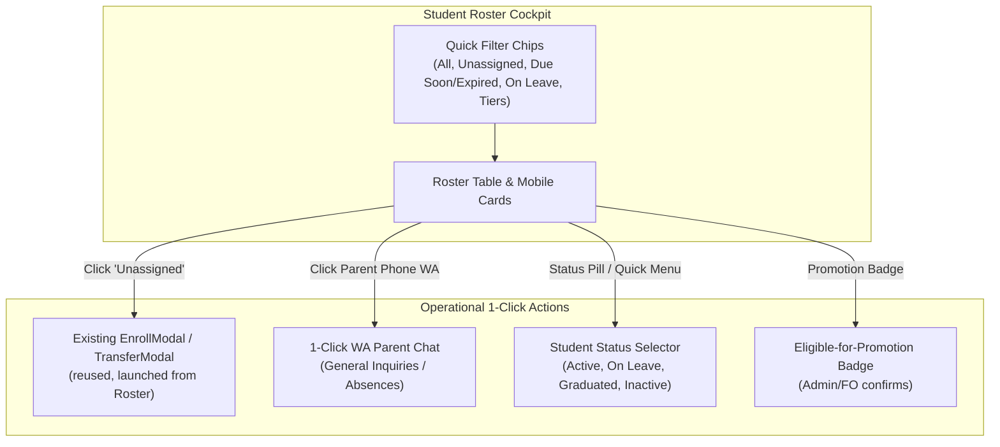

# Student Roster & Real-World Operations Implementation Plan (REVISED)

This plan addresses operational gaps in the **Admin & Front Office Student Roster**, turning it from a passive directory into an active operational cockpit.

> **Revision note:** This supersedes the original plan after a code audit turned up one blocking bug and a few real risks. Summary of what changed:
> 1. **Component 3** no longer builds a new modal — it reuses the existing `TransferModal.jsx` / `EnrollModal` instead of duplicating their logic a third time.
> 2. **Component 5** no longer has instructors write `currentLevel` directly — Firestore security rules don't permit it, and the original design would have failed silently in production (or required loosening rules in an unsafe way). Promotion is now Admin/Front-Office-confirmed by default.
> 3. **Component 1** now explicitly handles existing students who don't yet have a `status` field, so they don't disappear from the default roster view.
> 4. Noted the 65% vs 70% passing-mark inconsistency for the implementer to resolve.

---

## User Review Required

> [!IMPORTANT]
> **Key Operational Decisions to Confirm:**
> 1. **Batch Assignment from Roster**: When staff click `Unassigned` or "Assign Batch", should it open an inline modal displaying only batches matching the student's academic level range, or allow an override checkbox for special exceptions?
> 2. **Student Lifecycle States**: We propose 4 lifecycle statuses:
>    - `active` (default — currently enrolled & attending)
>    - `on_leave` (temporary pause / holiday / exam break)
>    - `graduated` (completed all course levels / program)
>    - `inactive` (withdrawn / dropped out)
>    *(Historical records and payment history are strictly preserved for all statuses; permanent delete remains available only for accidental duplicates).*
> 3. **Level Promotion Trigger**: When an instructor submits an evaluation report with an overall score ≥ 70%, should the system:
>    - **Option B (Recommended, and the only one that works with your current Firestore rules as-is)**: Keep the evaluation as a report with an `eligibleForPromotion` flag, and show an "Eligible for Promotion" badge on the Admin/FO Roster for a staff member with write access to confirm.
>    - **Option A (Instructor promotes on save)**: Technically possible, but instructors currently have **no Firestore write permission** on the `users` collection (see Security Impact below). Doing this safely requires a Cloud Function that runs the promotion server-side after validating the instructor is legitimately assigned to that class — meaningfully more work than Option B. Don't do this by loosening the `users` update rule for instructors; that would let any instructor account edit any student field, not just `currentLevel`.

---

## 1. Feature Architecture Overview



---

## 2. Proposed Changes

### Component 1: Student Lifecycle Status (`status`)

#### [MODIFY] [`src/features/students/studentRecord.js`](file:///e:/myliberty-portal/src/features/students/studentRecord.js)
- Add `status: clean(fields.status) || "active"`.
- Support statuses: `"active" | "on_leave" | "graduated" | "inactive"`.

#### [MODIFY] [`src/features/students/UserForm.jsx`](file:///e:/myliberty-portal/src/features/students/UserForm.jsx)
- Add Student Status selector under Section 2 (Academic & Enrollment Details) with color-coded badges:
  - `Active` (Emerald), `On Leave` (Amber), `Graduated` (Indigo), `Inactive` (Slate).

#### [MODIFY] [`src/features/dashboard/useDashboardData.js`](file:///e:/myliberty-portal/src/features/dashboard/useDashboardData.js)
- Persist `status` across `emptyFormData`, `handleAddStudent`, `handleEdit`, and `handleSave`.

#### ⚠️ Backward-compatibility requirement (new)
`buildStudentRecord()` only sets a default `status` for records built going forward — it does nothing for the students already sitting in Firestore today, since `saveStudentRecord` writes with `{ merge: true }` and only touches fields it's given. Any student who hasn't been edited since this ships will have **no `status` field at all**, not `"active"`.

Every place that filters or displays status **must** treat a missing value as `"active"`:
```js
const effectiveStatus = student.status || "active";
```
Do not filter with `student.status === "active"` directly anywhere — that would silently drop every existing student from the default roster view the day this ships. This applies to the filter chips in Component 2 and any dashboard stat counting active students.

---

### Component 2: Smart Operational Filter Chips

#### [MODIFY] [`src/features/students/StudentRoster.jsx`](file:///e:/myliberty-portal/src/features/students/StudentRoster.jsx)
- Add operational quick filter bar below search:
  - **Status Filter**: `Active` (default), `On Leave`, `Inactive / Graduated`, `All Students` — using `effectiveStatus` per above.
  - **Quick Action Pills**: `All`, `⚠️ Unassigned` (count of students with zero entries in `studentClasses`), `💳 Due Soon / Expired` (reuse `getPaymentHealthStatus`, already imported here), `⭐/⭐⭐/⭐⭐⭐` tier pills (reuse `getTier` from `../shared`, already used elsewhere in the app for this exact purpose).
- Counters on filter chips (e.g. `Unassigned (4)`).
- Only render the new filter bar when `!readOnly` — `StudentRoster` is also used read-only inside `InstructorDashboard.jsx`, and the filters have no reason to appear differently there, but the *action* affordances in Components 3–5 below must not.

---

### Component 3: 1-Click Batch Enrollment & Lateral Transfer from Roster

**Revised approach — reuse, don't rebuild.** The app already has two working implementations of "pick a compatible batch and move a student into it": `EnrollModal` inside [`src/features/classes/AvailableBatches.jsx`](file:///e:/myliberty-portal/src/features/classes/AvailableBatches.jsx) (handles both direct enrollment and lateral transfer, already using `isCompatible()`) and [`TransferModal.jsx`](file:///e:/myliberty-portal/src/features/classes/TransferModal.jsx) (transfer out of a current class). Both call the same `classesRepository` functions (`addStudentToClass`, `transferStudentBetweenClasses`, `syncStudentsCurrentLevel`). A third bespoke modal in `students/` would mean three copies of the same level-matching and seat-counting logic that can quietly drift apart.

#### [NEW] Export `EnrollModal` from `AvailableBatches.jsx` (or extract it to its own file, e.g. `src/features/classes/EnrollModal.jsx`, if that's cleaner) so it can be imported elsewhere.
- No behavior change — just makes it reusable outside `AvailableBatches.jsx`.

#### [MODIFY] [`src/features/students/StudentRoster.jsx`](file:///e:/myliberty-portal/src/features/students/StudentRoster.jsx)
- Make the `Unassigned` pill and class-name cells clickable (currently a plain `<span>`).
- On click, open the (now-shared) `EnrollModal`, passing the clicked student pre-selected, plus `classes` and `instructors` — new props this component doesn't currently receive.
- Gate this behind `!readOnly` (see Component 2 note — `InstructorDashboard` must not get write actions here).

#### [MODIFY] [`src/features/dashboard/AdminDashboard.jsx`](file:///e:/myliberty-portal/src/features/dashboard/AdminDashboard.jsx) and [`FrontOfficeDashboard.jsx`](file:///e:/myliberty-portal/src/features/dashboard/FrontOfficeDashboard.jsx)
- Pass `classes` and `instructors` down into `<StudentRoster>` (both already load this data for their own use elsewhere on the dashboard).

No Firestore rules changes needed here — Admin has full write access to `users` and `classes`, and Front Office's existing write path (role `student`, and `studentIds`/`enrollments`/`updatedAt` only on `classes`) is unchanged since it's the same repository functions already in use today.

---

### Component 4: 1-Click General WhatsApp Outreach for Parents

#### [MODIFY] [`src/features/students/StudentRoster.jsx`](file:///e:/myliberty-portal/src/features/students/StudentRoster.jsx)
- Beside the parent phone number (desktop table + mobile card), add a green WhatsApp icon button.
- Reuse `normalizeWhatsAppNumber` (already imported in this file for the renewal-reminder button) and open `https://wa.me/628...` with:
  > *"Halo Bapak/Ibu [ParentName], kami dari Liberty English Course ingin menginformasikan mengenai [StudentName]..."*

No changes needed elsewhere — this is a self-contained UI addition on top of an existing utility function.

---

### Component 5: Academic Progression & Level Promotion

#### [MODIFY] [`src/features/students/StudentProgressForm.jsx`](file:///e:/myliberty-portal/src/features/students/StudentProgressForm.jsx)
- When overall score is ≥ 70%, show a banner: *"Passed [Current Level] with [Score]%! Mark eligible for promotion?"*
- ⚠️ **Resolve the threshold mismatch first**: this form already shows "Standard passing mark: 65+" per criterion. Either change that label to 70, or change the promotion trigger to 65, so staff aren't shown two different numbers for "passing."
- On submit, include `eligibleForPromotion: true` on the `progressReports` document created via `createProgressReport`. This is a field the instructor is already permitted to write (the `progressReports` create rule doesn't restrict which fields can be included), so **no rules change needed**.
- Do **not** have this form write to `users/{studentId}` — see Security Impact below.

#### [MODIFY] [`src/features/students/StudentRoster.jsx`](file:///e:/myliberty-portal/src/features/students/StudentRoster.jsx)
- Show an "Eligible for Promotion" badge for students with a matching flagged report.
- Add a "Promote" action in the quick-actions menu (Admin/Front Office only — already permitted to write `currentLevel` to a student doc) that atomically updates `users/{studentId}.currentLevel` (and syncs `rating`) and clears the eligibility flag.

---

## 3. Security Impact (new section)

This is the part the original plan didn't check against `firestore.rules`, and it's the one worth being careful about:

- **`users/{userId}` update rule** only allows: Admin (any field), Front Office (only when `role == "student"`), or a signed-in user editing their own limited fields (`displayName`, `phone`, `dob`, `photoURL`, `nickname`). **Instructor is not in this list.**
- Component 5's original design had the instructor's evaluation form write `currentLevel` straight to the student's document. That write would be **denied by Firestore** for any real instructor account — this is the bug this revision fixes by moving the actual promotion to the Admin/Front-Office-only "Promote" action, which already has permission.
- Components 1–4 in this revision use only write paths Admin/Front Office already have today, so they need **no changes to `firestore.rules`**.
- If you later decide you *do* want instructors to trigger promotion directly (Option A), that requires either (a) a narrowly-scoped rules change letting an instructor update only `currentLevel`/`rating` on a student who's genuinely enrolled in one of their classes (harder to write correctly than it sounds — worth getting a second pair of eyes on it), or (b) a Cloud Function that does the update server-side after checking the instructor teaches that student. Don't ship a broad "instructor can update users" rule to make this work — that's a much bigger permission than the feature needs.

---

## 4. Verification Plan

### Automated Build & Lint Verification
- `npm run lint` — 0 errors, 0 warnings.
- `npm run build` — Clean Vite production build.

### Manual Verification Flows
1. **Admissions → Direct Placement**: Approve application → open Student Roster → see student under `Unassigned (1)` → click `Unassigned` → the (reused) enroll modal opens → select compatible batch → student is enrolled without navigating to the Classes tab.
2. **Legacy students don't disappear**: Pick a student who existed before this change and hasn't been edited since. Confirm they still show up under the default `Active` filter (this is the missing-`status` case — if they vanish, the filter isn't using the `|| "active"` fallback).
3. **Operational Filters**: `Due Soon / Expired`, `Unassigned`, `On Leave` chips each filter correctly with accurate counts.
4. **Student Lifecycle**: Change status to `On Leave` → student disappears from default `Active` view, appears under `On Leave` → payment and attendance history remain intact.
5. **WhatsApp General Chat**: Icon next to parent phone opens WhatsApp with the formatted Indonesian greeting.
6. **Level Promotion — as an Instructor account**: Submit an evaluation ≥ 70% → confirm the report saves with `eligibleForPromotion: true` and **no error** (this is the case that would have failed under the original design — test with an actual instructor login, not an admin one).
7. **Level Promotion — as an Admin/Front Office account**: Confirm the "Eligible for Promotion" badge shows on the Roster, and clicking "Promote" advances `currentLevel` in Firestore and clears the badge.
